<<<<<<< HEAD
# Diagramas del Sistema de Gestión de Aeropuertos

## Diagrama de Arquitectura del Sistema

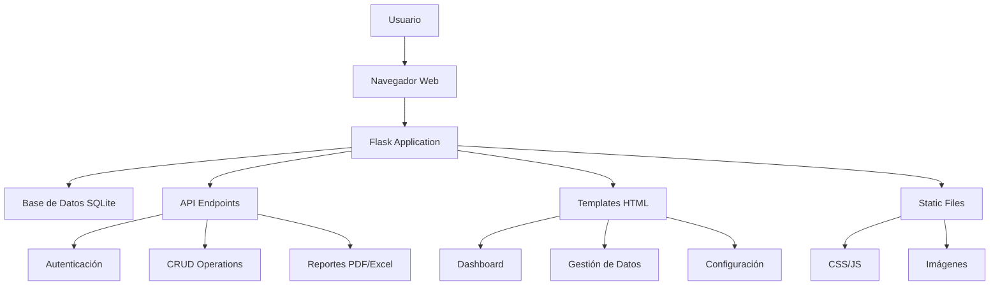

## Flujo de Autenticación

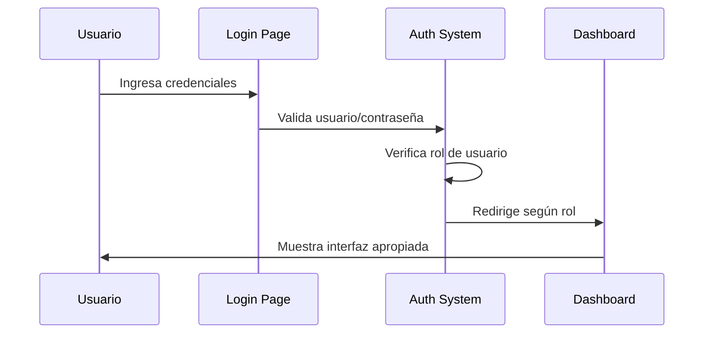

## Estructura de la Base de Datos

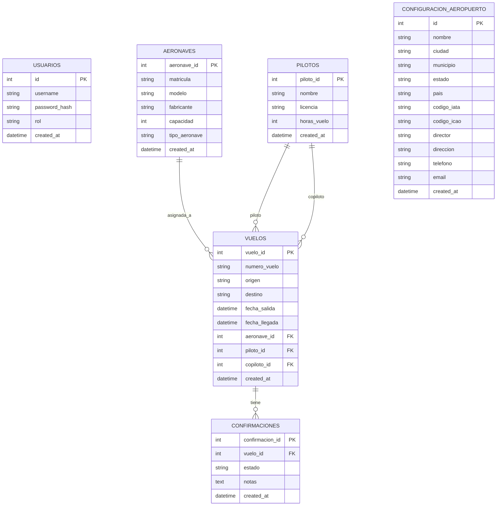

## Flujo de Gestión de Vuelos

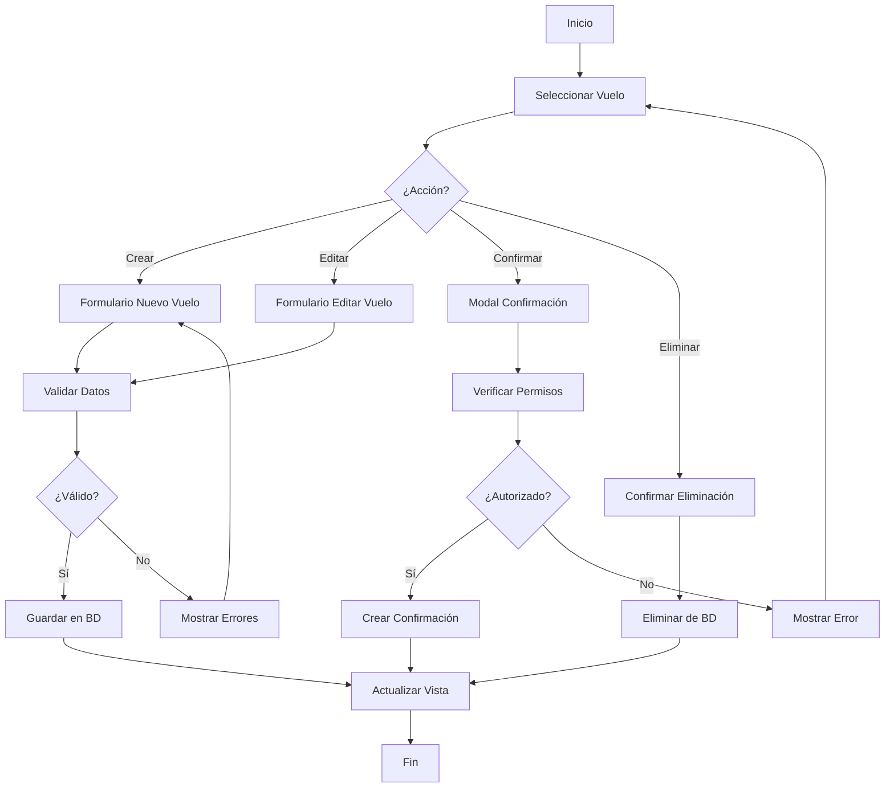

## Jerarquía de Roles y Permisos

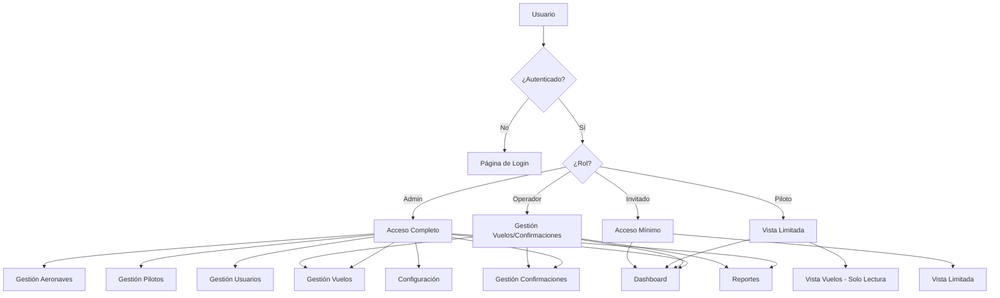

## Flujo de Generación de Reportes

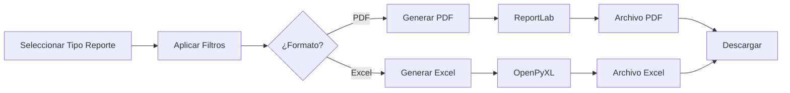

## Estructura de Archivos del Proyecto

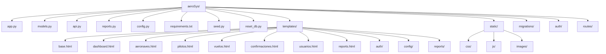

## Flujo de Configuración del Aeropuerto

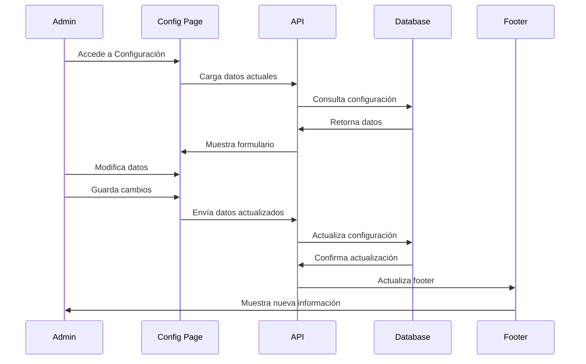

## Estados de un Vuelo

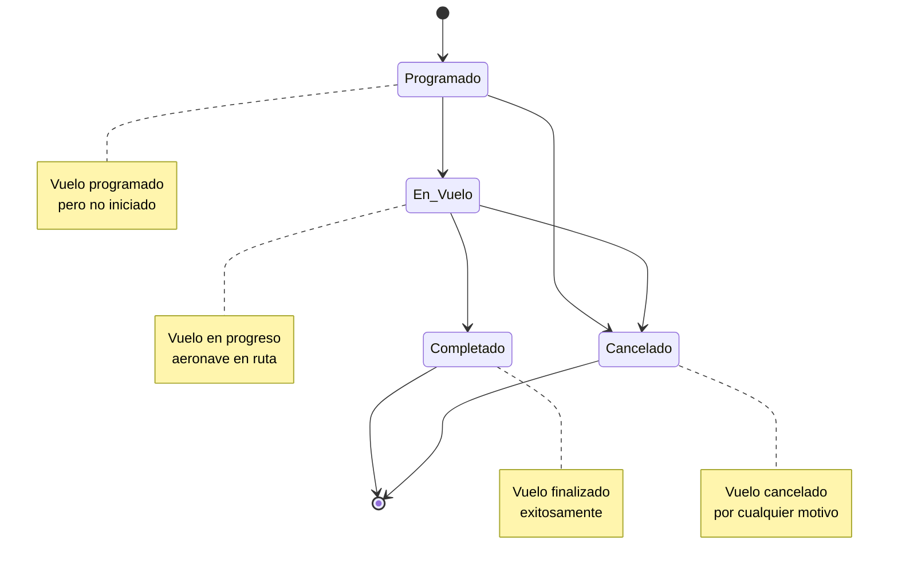

## Flujo de Confirmación de Vuelos

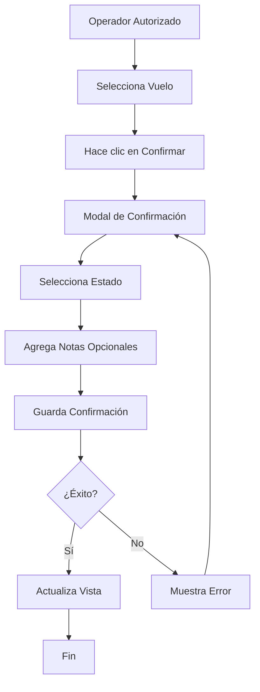

## Responsive Design - Breakpoints

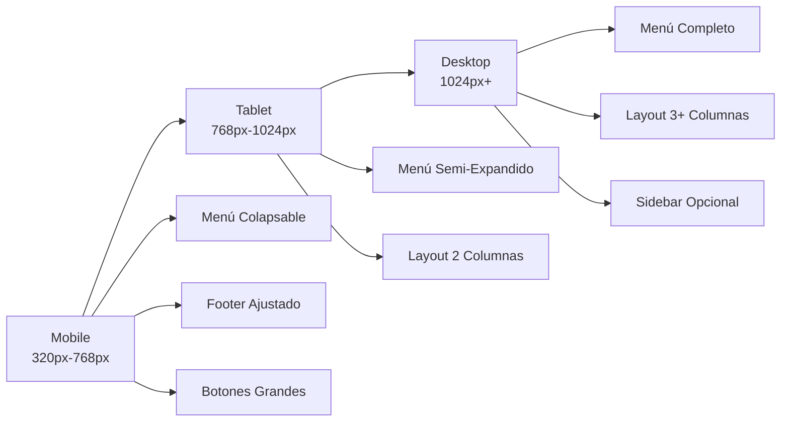

## Flujo de Instalación

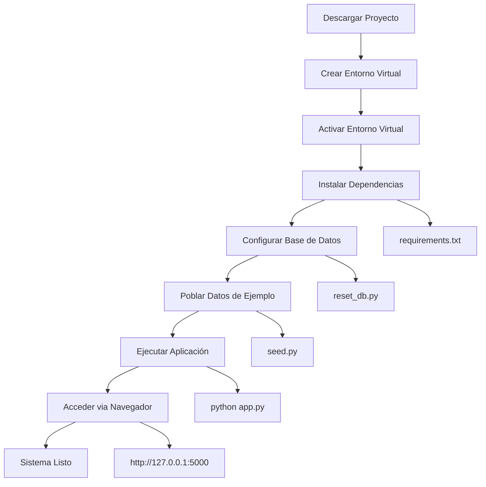

## Arquitectura de Seguridad

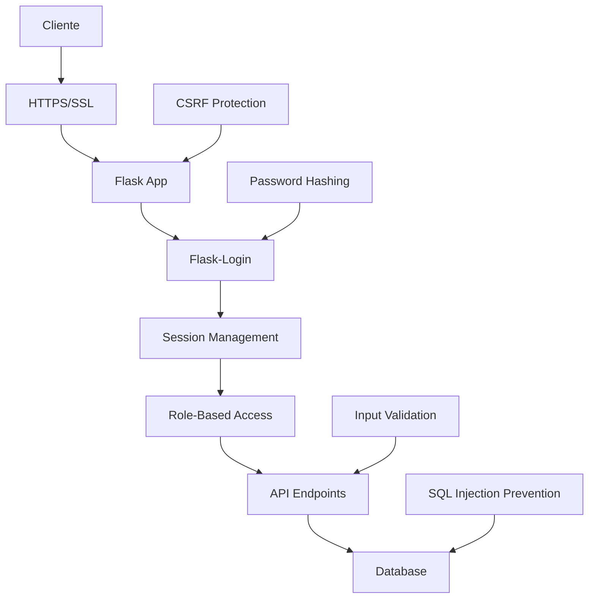

Estos diagramas proporcionan una visión completa de la arquitectura, flujos y funcionalidades del Sistema de Gestión de Aeropuertos, complementando el Manual de Usuario con representaciones visuales claras y detalladas.
=======
# Diagramas del Sistema de Gestión de Aeropuertos

## Diagrama de Arquitectura del Sistema


## Flujo de Autenticación


## Estructura de la Base de Datos


## Flujo de Gestión de Vuelos


## Jerarquía de Roles y Permisos


## Flujo de Generación de Reportes


## Estructura de Archivos del Proyecto


## Flujo de Configuración del Aeropuerto

```mermaid
sequenceDiagram
    participant A as Admin
    participant C as Config Page
    participant API as API
    participant DB as Database
    participant F as Footer
    
    A->>C: Accede a Configuración
    C->>API: Carga datos actuales
    API->>DB: Consulta configuración
    DB->>API: Retorna datos
    API->>C: Muestra formulario
    
    A->>C: Modifica datos
    A->>C: Guarda cambios
    C->>API: Envía datos actualizados
    API->>DB: Actualiza configuración
    DB->>API: Confirma actualización
    API->>F: Actualiza footer
    F->>A: Muestra nueva información
```

## Estados de un Vuelo

```mermaid
stateDiagram-v2
    [*] --> Programado
    Programado --> En_Vuelo
    Programado --> Cancelado
    En_Vuelo --> Completado
    En_Vuelo --> Cancelado
    Completado --> [*]
    Cancelado --> [*]
    
    note right of Programado
        Vuelo programado
        pero no iniciado
    end note
    
    note right of En_Vuelo
        Vuelo en progreso
        aeronave en ruta
    end note
    
    note right of Completado
        Vuelo finalizado
        exitosamente
    end note
    
    note right of Cancelado
        Vuelo cancelado
        por cualquier motivo
    end note
```

## Flujo de Confirmación de Vuelos

```mermaid
flowchart TD
    A[Operador Autorizado] --> B[Selecciona Vuelo]
    B --> C[Hace clic en Confirmar]
    C --> D[Modal de Confirmación]
    D --> E[Selecciona Estado]
    E --> F[Agrega Notas Opcionales]
    F --> G[Guarda Confirmación]
    G --> H{¿Éxito?}
    H -->|Sí| I[Actualiza Vista]
    H -->|No| J[Muestra Error]
    I --> K[Fin]
    J --> D
```

## Responsive Design - Breakpoints

```mermaid
graph LR
    A[Mobile<br/>320px-768px] --> B[Tablet<br/>768px-1024px]
    B --> C[Desktop<br/>1024px+]
    
    A --> D[Menú Colapsable]
    A --> E[Footer Ajustado]
    A --> F[Botones Grandes]
    
    B --> G[Menú Semi-Expandido]
    B --> H[Layout 2 Columnas]
    
    C --> I[Menú Completo]
    C --> J[Layout 3+ Columnas]
    C --> K[Sidebar Opcional]
```

## Flujo de Instalación

```mermaid
flowchart TD
    A[Descargar Proyecto] --> B[Crear Entorno Virtual]
    B --> C[Activar Entorno Virtual]
    C --> D[Instalar Dependencias]
    D --> E[Configurar Base de Datos]
    E --> F[Poblar Datos de Ejemplo]
    F --> G[Ejecutar Aplicación]
    G --> H[Acceder via Navegador]
    H --> I[Sistema Listo]
    
    D --> J[requirements.txt]
    E --> K[reset_db.py]
    F --> L[seed.py]
    G --> M[python app.py]
    H --> N[http://127.0.0.1:5000]
```

## Arquitectura de Seguridad

```mermaid
graph TB
    A[Cliente] --> B[HTTPS/SSL]
    B --> C[Flask App]
    C --> D[Flask-Login]
    D --> E[Session Management]
    E --> F[Role-Based Access]
    F --> G[API Endpoints]
    G --> H[Database]
    
    I[Password Hashing] --> D
    J[CSRF Protection] --> C
    K[Input Validation] --> G
    L[SQL Injection Prevention] --> H
```

Estos diagramas proporcionan una visión completa de la arquitectura, flujos y funcionalidades del Sistema de Gestión de Aeropuertos, complementando el Manual de Usuario con representaciones visuales claras y detalladas.
>>>>>>> 348e468 (Actualización de archivos y carpetas)
